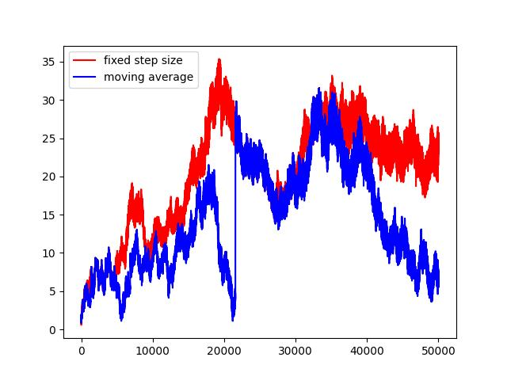

# 2 多臂赌博机

# 2.1
$$
\operatorname{Pr}[a_{optimal}]=1-\epsilon=0.5
$$

# 2.2

$$
A_1=1, R_1=-1, Q_1=-1,optimal=\{234\}
$$

$$
A_2=2, R_2=1, Q_2=1,optimal=\{2\}
$$

$$
A_3=2, R_3=-2, Q_2=(1-2)/2=-0.5,optimal=\{34\}
$$

$$
A_4=2, R_4=2, Q_2=-0.5 + (2+0.5)/3\approx0.33,optimal=\{2\}
$$

$$
A_5=3,...
$$

可见，t=4和t=5的时候都没有选择最佳策略，肯定是探索。

t=2的时候从3个optimal中只选了一个，也有可能是探索。

*注：刚才用到了一个增量式求平均的方法，可参考书Eq (2.4)。

# 2.3

估算了一下图里的值。

| epsilon | average reward | best action % |
| ------- | -------------- | ------------- |
| 0       | 1              | 35%           |
| 0.01    | 1.4            | 50%           |
| 0.1     | 1.5            | 80%           |

# 2.4

$$
\begin{aligned}
Q_{n+1}&=Q_n+\alpha_n[R_n - Q_n]\\
&=  \alpha_n R_n + (1-\alpha_n)Q_n\\
&=\alpha_n R_n + (1-\alpha_n)(\alpha_{n-1} R_{n-1} + (1-\alpha_{n-1})Q_{n-1})\\
&=\alpha_n R_n + (1-\alpha_n)\alpha_{n-1} R_{n-1} + (1-\alpha_n)(1-\alpha_{n-1})Q_{n-1}\\
&=\dots
\end{aligned}
$$
因此，对于$R_i(1\leq i\leq n)$，系数是
$$
(1-\alpha_n)(1-\alpha_{n-1})\dots(1-\alpha_{i+1})\alpha_{i}
$$

# 2.5
代码见`2.5.py`。

每个episode取100步，总共10000个episode。

best action rate就暂时不画了，反正也是fixed step size比较好。

结论：对于这种reward随时间改变的bandit，采取fixed step size可以有效遗忘很早的知识，更关注于近期的知识。

